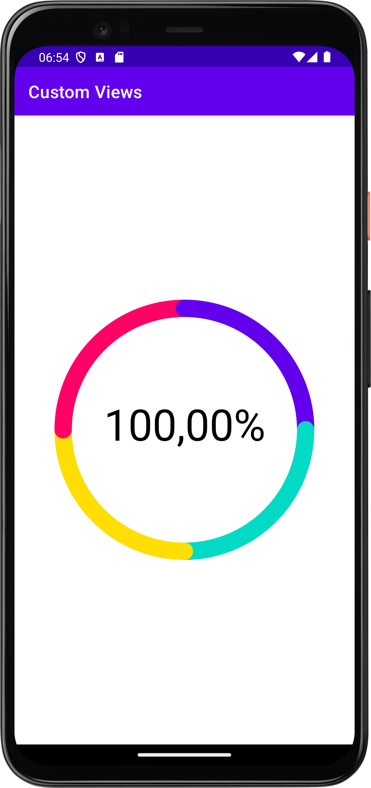
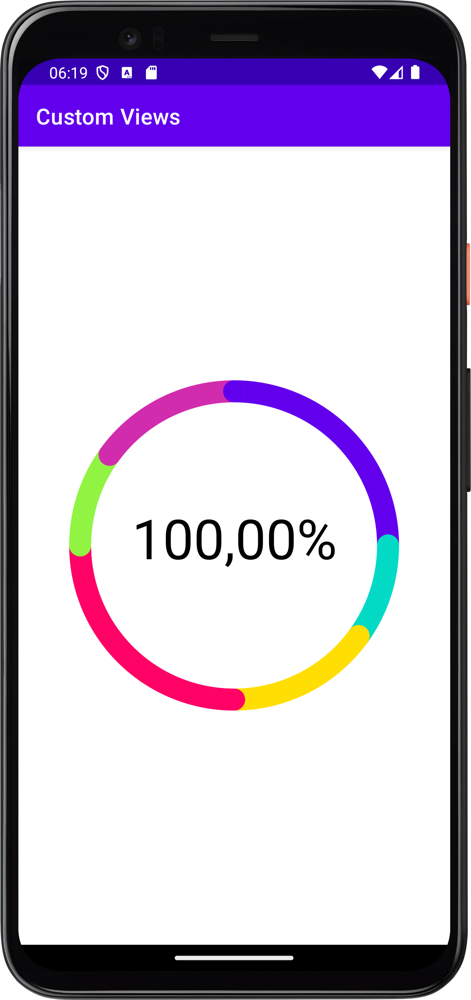
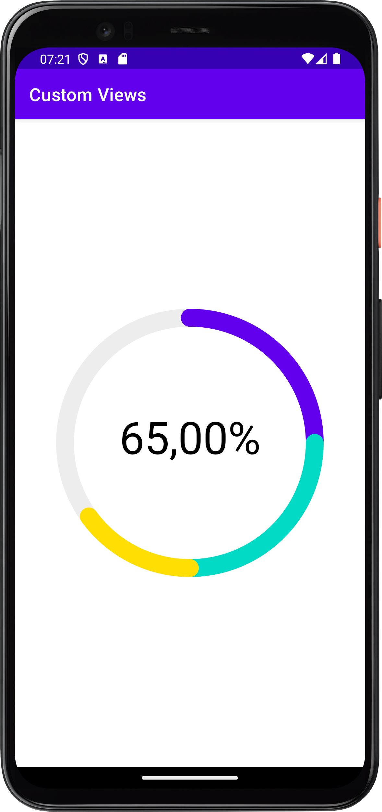

## Задание к занятию «Custom Views — разработка собственных элементов интерфейса» (Smart StatsView, Not Filled)


### Smart StatsView

Реализована круговая диаграмма, которая может принимать на вход как доли:


```kotlin
findViewById<StatsView>(R.id.stats).data = listOf(
    0.25F,
    0.25F,
    0.25F,
    0.25F,
)
```
<p float="left">

</p>

так и данные, по которым сама рассчитывает проценты:

```kotlin
findViewById<StatsView>(R.id.stats).data = listOf(
    500F,
    200F,
    300F,
    500F,
    200F,
    300F
)
```

`SmartStatsView` суммирует все данные и определяет долю каждого элемента в процентах: 

<p float="left">

</p>


### Not Filled

`SmartStatsView` принимает на вход доли и, в случае если их сумма менее 100%, на диаграмме остается незаполненная часть:

```kotlin
findViewById<StatsView>(R.id.stats).data = listOf(
    0.25F,
    0.25F,
    0.15F,
)
```
<p float="left">

</p>